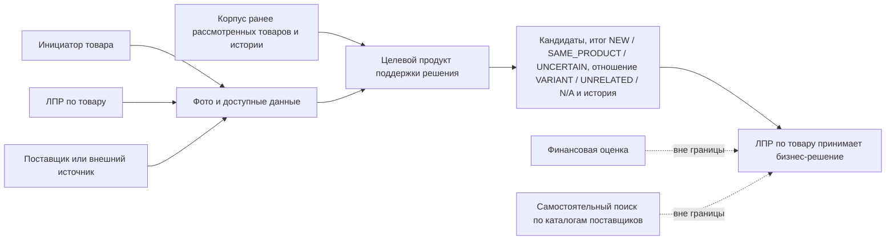

# Vision & Scope

> [Индекс анализа](README.md) · [Текущий контекст](current-context.md) · [Предыдущий: `ART-00`](00-source-and-decision-register.md) · [Следующий: `ART-02`](README.md#реестр-артефактов)

| Поле | Значение |
|---|---|
| Идентификатор артефакта | `ART-01` |
| Версия | `0.6` |
| Дата | 2026-08-17 |
| Статус | `APPROVED_BY_OWNER` |
| Владелец и утверждающий | Владелец проекта (пользователь) |
| Автор | Codex |
| Утверждённый вход | `ART-00` версии 0.7, `APPROVED_BY_OWNER` |
| Область | Полная целевая система; первый прототип выделен как этап проверки гипотез |
| Классификация | `RESTRICTED_PENDING_CLASSIFICATION` по правилам `ART-00`, §4.2 |

## 1. Назначение документа

Документ определяет бизнес-проблему, видение целевого продукта, пользователей, ожидаемую ценность, границы полной системы и место первого прототипа.

Документ отвечает на вопросы «зачем» и «что входит в продукт». Он не выбирает визуальную модель, базу данных, API, платформу запуска и другие элементы технической архитектуры (`DEC-016`, `DEC-009`).

## 2. Исходная ситуация и проблема

### 2.1. Подтверждённый контекст

| ID | `assertion_type` | `evidence_status` | Утверждение | Источник и локатор |
|---|---|---|---|---|
| `VS-F-001` | `STAKEHOLDER_STATEMENT` | `VERIFIED` | По описанию заказчика сотрудник добавляет ссылку в столбец J, а при повторе той же ссылки текущая проверка показывает `ДУБЛИКАТ AS-IS` в H | `SRC-001`, смысловой фрагмент о ссылке в J и отметке H. Механизм формулы в текущем проходе live не проверялся |
| `VS-F-002` | `STAKEHOLDER_STATEMENT` | `VERIFIED` | Текущий инструмент не связывает один товар между разными продавцами, площадками, ссылками или артикулами | `SRC-001`, фрагмент «если ... такой же самый товар, но на другом сайте ... никакого совпадения не будет» |
| `VS-F-003` | `STAKEHOLDER_STATEMENT` | `VERIFIED` | Связь новой позиции с ранее рассмотренным товаром не фиксируется; сотрудникам приходится полагаться на память | `SRC-001`, фрагмент «отметить это мы никак не можем» и описание невозможности помнить все проверенные товары |
| `VS-F-004` | `STAKEHOLDER_STATEMENT` | `VERIFIED` | Товар может поступить на проверку в обратном сценарии как фотография от поставщика, в том числе в другом цвете; сотруднику важна история прежнего рассмотрения | `SRC-001`, фрагмент о поставщике и голубом/серебристом/золотистом варианте |
| `VS-F-005` | `FACT_CLAIM` | `PARTIAL` | Плановая оценка полного корпуса составляет около 15 000 товаров с приростом около 500 товаров в месяц | `FACT-001`, подтверждение владельца `SRC-018`; значения ещё не сверены с полной выгрузкой |
| `VS-F-006` | `FACT_CLAIM` | `VERIFIED` | Количественный baseline текущих временных потерь и повторной работы не измерялся | `FACT-002`, подтверждение владельца `SRC-018` |
| `VS-F-007` | `OBSERVATION` | `VERIFIED` | В CSV-снимке логические записи 6 и 10 содержат одинаковое экспортированное значение I и значение H `ДУБЛИКАТ` — то есть отметку `ДУБЛИКАТ AS-IS`; это подтверждает экспортированный результат проверки, но не формулу | `SRC-003`, логические записи 6 и 10, столбцы H–I; SHA-256 `ac8832e54e915523b0736ffd36f0eb63f6deac5658c5e0c81523abcf07e13623`; метод чтения — `ART-00`, §4.1 |

Статус `VERIFIED` для `STAKEHOLDER_STATEMENT` означает, что формулировка точно присутствует в интервью. Он не означает независимую проверку фактической распространённости или частоты проблемы.

### 2.2. Формулировка проблемы

Команда не располагает единым способом по изображению и доступным данным определить, рассматривался ли тот же товар ранее под другой карточкой, у другого продавца, на другой площадке или в другом варианте. Из-за этого накопленная история решений не всегда возвращается в момент нового рассмотрения, а сотрудники вынуждены полагаться на личную память (`VS-F-002`–`VS-F-004`).

Проблема состоит не в отсутствии ещё одного признака `ДУБЛИКАТ AS-IS`, а в отсутствии связи между новой находкой, тем же товаром или его вариантом и историей предыдущих рассмотрений (`DEC-001`, `DEC-031`, `DEC-032`).

## 3. Видение продукта

### 3.1. Vision statement

Для сотрудников, которые предлагают новые товары, и отдельных сотрудников, принимающих решения по ним, целевой продукт является внутренним инструментом поддержки решения. По фотографии и доступным данным он помогает найти ранее рассмотренные позиции и показывает историю работы с ними. Итог поиска по запросу выражается как `NEW`, `SAME_PRODUCT` или `UNCERTAIN`; для конкретного отличающегося кандидата отдельно указывается `VARIANT` или `UNRELATED`, а для подтверждённого `SAME_PRODUCT` отношение имеет значение `N/A`.

В отличие от текущей проверки внешнего идентификатора, продукт должен работать при различиях продавца, ссылки, артикула, площадки, фотографии или варианта товара. Продукт не принимает окончательное бизнес-решение вместо сотрудника (`DEC-001`, `DEC-025`, `DEC-026`, `DEC-031`).

### 3.2. Принципы видения

| ID | Принцип | Основание |
|---|---|---|
| `VP-001` | История важнее бинарной отметки: пользователь должен видеть, что находили и решали ранее | `DEC-001`; `SRC-001`, обратный сценарий от поставщика |
| `VP-002` | Решение остаётся за человеком; система формирует кандидатов и основания для проверки | `DEC-001` |
| `VP-003` | Итог поиска `NEW / SAME_PRODUCT / UNCERTAIN` и отношение к отличающемуся кандидату `VARIANT / UNRELATED` — разные оси; для `SAME_PRODUCT` вторая ось равна `N/A` | `DEC-031` |
| `VP-004` | Временные границы прототипа не считаются границами полного продукта | `DEC-012` |
| `VP-005` | Качество и бизнес-эффект доказываются измерениями, а не демонстрацией интерфейса | `DEC-008`, `DEC-024` |
| `VP-006` | Техническая реализация не является частью текущего Vision | `DEC-009`, `DEC-016` |

### 3.3. Две оси результата

| Ось | Объект оценки | Значения | Смысл |
|---|---|---|---|
| Итог поиска | Запрос в целом относительно доступного корпуса | `NEW`, `SAME_PRODUCT`, `UNCERTAIN` | Тот же товар не найден, подтверждён либо данных недостаточно для вывода |
| Отношение к кандидату | Пара «запрос — конкретный отличающийся кандидат» | `VARIANT`, `UNRELATED` | Кандидат является вариантом той же базовой модели либо другим товаром |
| Неприменимость второй оси | Пара с подтверждённым тем же товаром | `N/A` | Для `SAME_PRODUCT` дополнительное отношение не классифицируется |

`ANALOG` не является значением ни одной оси и исключён из границы продукта (`DEC-030`, `DEC-031`).

## 4. Бизнес-цели

| ID | Цель | Наблюдаемый результат | Текущее состояние измерения | Источник |
|---|---|---|---|---|
| `BG-001` | Снизить повторную работу при рассмотрении уже известного товара или связанного варианта | Снижается время и число повторных разборов относительно зафиксированного baseline | Baseline отсутствует; требуется `MEAS-001` | `VS-F-003`, `DEC-024` |
| `BG-002` | Возвращать накопленную историю в момент рассмотрения новой находки | Пользователь видит релевантные ранее рассмотренные позиции и прежние решения | Мера будет определена после описания истории и контрольной выборки | `DEC-001`, `VP-001` |
| `BG-003` | Снизить зависимость результата от памяти конкретного сотрудника | История доступна инициатору и ЛПР через согласованный сценарий поиска | Текущая зависимость подтверждена интервью, целевой показатель не определён | `VS-F-003`, `DEC-025`, `DEC-026` |
| `BG-004` | Различать новый товар, тот же товар и вариант без автоматического переноса бизнес-решения | Пользователь получает итог `NEW / SAME_PRODUCT / UNCERTAIN` и, когда применимо, отношение `VARIANT / UNRELATED`, затем принимает бизнес-решение | Базовые классы приняты; пограничные правила и способ фиксации обратной связи ещё не описаны | `DEC-001`, `DEC-029`, `DEC-031`, `GAP-003` |
| `BG-005` | Получить доказательство применимости подхода до расширения на полный корпус | Первый прототип измерен на зафиксированной контрольной выборке | Предварительные критерии приняты, но ещё не операционализированы | `DEC-005`, `DEC-007`, `DEC-008`, `GAP-011` |

## 5. Пользователи и участники контекста

### 5.1. Основные пользователи

| ID | Группа | Потребность | Статус определения |
|---|---|---|---|
| `USR-001` | `Инициатор товара` | До дальнейшей проработки понять, встречался ли товар или вариант ранее | Функциональную роль могут выполнять маркетологи, сотрудники продаж, логисты и другие сотрудники (`DEC-025`, `FACT-003`) |
| `USR-002` | `ЛПР по товару` | Получить историю и основания для окончательного решения по предложенному товару | Роль отделена от инициатора; точная должность и полномочия остаются `UNKNOWN` до `ART-02` и AS-IS (`DEC-026`) |

### 5.2. Другие участники

| ID | Участник | Отношение к продукту | Основание |
|---|---|---|---|
| `CTX-001` | Поставщик | Может передавать фотографии или сведения о товаре, но не является пользователем продукта в согласованной границе | `DEC-022`, `DEC-034`; `SRC-001`, обратный сценарий |
| `CTX-002` | Владелец проекта | Утверждает аналитические артефакты и принимает проектные решения | `DEC-013` |

Полный список стейкхолдеров, официальные названия ролей и полномочия будут определены в `ART-02` (`GAP-002`).

## 6. Граница целевого продукта

### 6.1. Входит в полную целевую систему

| ID | Возможность или область | Основание |
|---|---|---|
| `SCOPE-001` | Принимать фотографию новой находки или варианта товара и доступные описательные данные | `DEC-001`; `SRC-001`, прямой и обратный сценарии |
| `SCOPE-002` | Искать кандидатов среди рабочей таблицы, действующего ассортимента, архивов рассмотрений и доступных фотографий | `DEC-003` |
| `SCOPE-003` | Находить тот же товар независимо от продавца, площадки, ссылки, артикула или фотографии | `DEC-001`; `VS-F-002` |
| `SCOPE-004` | Показывать итог запроса `NEW / SAME_PRODUCT / UNCERTAIN` и отдельно отношение `VARIANT / UNRELATED` к конкретному отличающемуся кандидату; для `SAME_PRODUCT` возвращать `N/A` по второй оси | `DEC-029`, `DEC-031` |
| `SCOPE-005` | Показывать пользователю доступную историю предыдущего рассмотрения найденных кандидатов | `DEC-001`, `VP-001` |
| `SCOPE-006` | Представлять результат как поддержку решения, не разрешая и не запрещая ввод товара автоматически | `DEC-001` |

### 6.2. Не входит в согласованную границу продукта

| ID | Исключение | Обоснование или маршрут |
|---|---|---|
| `OUT-001` | Расчёт финансовой эффективности товара и восстановление финансовых формул текущей таблицы | `DEC-022`; отдельная бизнес-задача |
| `OUT-002` | Самостоятельный поиск по каталогам поставщиков как отдельная функция | `DEC-022`; каталоги могут быть источником фотографий, но не самостоятельным предметом продукта |
| `OUT-003` | Закупка, коммуникация с поставщиками и управление поставками | Не следует из подтверждённой проблемы; отдельный процесс при появлении запроса |
| `OUT-004` | Автоматическое разрешение или запрет ввода товара без решения сотрудника | `DEC-001` |
| `OUT-005` | Выбор модели, БД, API, контейнерной платформы и детальной архитектуры | `DEC-009`, `DEC-016`; будущий технический пакет |
| `OUT-006` | Обязательный прямой доступ к основной БД и регулярная синхронизация на первом этапе | `DEC-004`; пересмотреть перед промышленной эксплуатацией |
| `OUT-007` | Поиск и отдельная классификация аналогов | `DEC-030`; похожая, но иная модель считается другим товаром и не образует класс `ANALOG` |

### 6.3. Контекстная диаграмма границы

Диаграмма описывает бизнес-границу, а не компоненты технической архитектуры.

Способ фиксации человеческого решения и передачи обратной связи в продукт пока не утверждён (`VQ-008`). Возврат существующей истории входит в границу, но write-back нового решения не предполагается автоматически.

## 7. Полная система и первый прототип

| Измерение | Полная целевая система | Первый прототип |
|---|---|---|
| Назначение | Возвращать историю и связанные товары в регулярном рабочем процессе | Проверить осуществимость поиска, качество кандидатов и базовый пользовательский сценарий |
| Корпус | Рабочая таблица, действующий ассортимент, архивы и фотографии (`DEC-003`) | Копия текущей таблицы и записи с фактически доступными изображениями (`DEC-005`) |
| Масштаб | Плановая оценка около 15 000 товаров и +500 в месяц; требуется сверка с выгрузкой (`VS-F-005`) | В `SRC-003` воспроизводимо найдены 773 строки данных с непустым K или M: 321 с K и 452 с M. Все 452 значения M в CSV равны `#REF!`, поэтому 773 — только верхняя граница непустых полей экспорта, а не число доступных изображений. Доступность URL не проверена (`GAP-005`) |
| Пользователи | Основные группы `USR-001` и `USR-002`; роли и доступ уточняются | Локальный однопользовательский режим без авторизации (`DEC-006`) |
| Ввод | Фото и доступные данные из согласованных сценариев | Одна фотография и ручная обрезка объекта (`DEC-006`) |
| Вывод | Кандидаты, история, итог `NEW / SAME_PRODUCT / UNCERTAIN` и отношение `VARIANT / UNRELATED / N/A` | До десяти кандидатов с фотографией, описанием и прежним решением; те же две оси результата (`DEC-006`, `DEC-031`) |
| Решение | Принимает `ЛПР по товару` | Проверяет назначенный участник прототипа; это проектная функция, а не операционная роль аналитика (`DEC-027`, `DEC-033`) |
| Данные | Способ регулярного обновления ещё не определён | Допустима однократная выгрузка; live-интеграция не обязательна (`DEC-004`) |
| Доказательство успеха | Бизнес-эффект относительно будущего baseline и качество на согласованном оценочном корпусе; критерии представительности ещё не определены | Предварительные критерии `DEC-008` на версионированной контрольной выборке |

Результаты ограниченного прототипа нельзя автоматически переносить на полный корпус, другие категории или промышленную нагрузку.

Подсчёт полей K/M выполнен для 1 536 записей данных `SRC-003` — логические записи 6–1541: после удаления пробелов строка учитывалась, если K или M были непустыми. Контрольная сумма источника: `ac8832e54e915523b0736ffd36f0eb63f6deac5658c5e0c81523abcf07e13623`. Проверка не открывала URL и не восстанавливала значения `#REF!`.

## 8. Успех и измерение эффекта

### 8.1. Условия бизнес-успеха

| ID | Условие | Способ подтверждения | Статус |
|---|---|---|---|
| `SUCCESS-001` | Пользователи получают релевантную историю до повторной проработки товара | Проверка пользовательских сценариев и доли случаев, где история была найдена | Методика `TBD` после AS-IS/TO-BE и `MEAS-001` |
| `SUCCESS-002` | Повторная работа и время проверки снижаются относительно исходного уровня | Сравнение согласованных показателей до и после пилота | Baseline отсутствует (`VS-F-006`) |
| `SUCCESS-003` | Результат поиска не заменяет человеческое бизнес-решение | Аудит процесса и пользовательских решений | Принцип утверждён `DEC-001` |
| `SUCCESS-004` | Поиск достигает согласованного качества на зафиксированной контрольной выборке | Расчёт операционализированных метрик по классам и категориям | Предварительные пороги приняты `DEC-008`; определения остаются в `GAP-011` |
| `SUCCESS-005` | Полученное качество воспроизводимо на зафиксированных версиях данных и правил разметки | Повторный расчёт на неизменном benchmark | Требования будут детализированы в `ART-07` и `ART-09` |

### 8.2. Планируемая задача измерения baseline

`MEAS-001` должна быть заведена отдельно до оценки бизнес-эффекта пилота (`DEC-024`). Ниже приведён предлагаемый минимальный предмет задачи; конкретный состав будет утверждён владельцем задачи:

- определить начало и конец текущей проверки товара;
- измерить медиану и распределение времени проверки;
- посчитать повторные рассмотрения уже известных товаров или вариантов за период;
- оценить долю случаев, когда прежняя история была найдена без системы;
- зафиксировать период, выборку, участников и правила исключения;
- повторить сопоставимое измерение после пилота.

Владелец задачи, период измерения, целевые значения и инструмент сбора пока `UNKNOWN`. Эти значения нельзя заменять предположениями.

### 8.3. Предварительные критерии первого прототипа

| Метрика | Предварительный порог | Ограничение |
|---|---:|---|
| `SAME_PRODUCT Recall@10` | не ниже 95% | Требуется определить состав запросов и правила положительного кандидата |
| `VARIANT Recall@10` | не ниже 85% | Требуются правила варианта по категориям |
| Ложный уверенный `SAME_PRODUCT` для нового товара | не выше 5% | Требуется определить знаменатель и понятие «уверенный» |
| Время ответа после завершения индексации | большинство запросов не дольше 5 секунд | Требуется определить процентиль, границы измерения и тестовую среду |

Пороги являются решением `DEC-008`, но ещё не являются готовыми критериями приёмки до закрытия `GAP-011`.

## 9. Ограничения и допущения

| ID | Тип | Положение | Влияние или контроль |
|---|---|---|---|
| `CON-001` | Ограничение | Исходная рабочая Google Sheets недоступна по сообщению владельца; анализируется копия | Интервью и копия позволяют частично реконструировать AS-IS, но полнота production-процесса неизвестна. Достаточность источников оценивается на quality gate `ART-03` (`SRC-015`) |
| `CON-002` | Ограничение | Прямой доступ к основной БД не гарантирован | Первый этап строится на однократной выгрузке (`DEC-004`) |
| `CON-003` | Ограничение | Финальная инфраструктура неизвестна | Vision не закрепляет платформу (`DEC-009`) |
| `CON-004` | Ограничение | Исходные данные имеют временную классификацию `RESTRICTED_PENDING_CLASSIFICATION` | Не публиковать исходники и полный идентификатор Sheets без решения владельца данных (`ART-00`, §4.2) |
| `ASM-001` | Плановое допущение | Для оценки масштаба используется около 15 000 товаров и прирост около 500 в месяц | Сверить с полной выгрузкой до производственных требований (`FACT-001`) |
| `ASM-002` | Допущение | Коллеги смогут подготовить достаточный однократный источник данных | Доступность, формат и полнота ещё не подтверждены (`SRC-011`–`SRC-014`) |

## 10. Основные риски Vision

| ID | Риск | Последствие | Контроль или маршрут |
|---|---|---|---|
| `RISK-V-001` | Полный корпус и фотографии окажутся недоступными или несвязанными | Продукт не сможет возвращать полную историю | Инвентаризация источников и требования к данным в `ART-07` |
| `RISK-V-002` | Команда по-разному понимает `SAME_PRODUCT` и `VARIANT` | Разметка и метрики будут несопоставимыми | Глоссарий, примеры и бизнес-правила в `ART-02` и `ART-05` |
| `RISK-V-003` | Прототип оптимизируется под малую или смещённую выборку | Результат не переносится на полный корпус | Версионированная контрольная выборка; необходимость и правила стратификации являются предлагаемым контролем и должны быть решены в `ART-07`/`ART-09` |
| `RISK-V-004` | Система показывает уверенный ошибочный результат `SAME_PRODUCT` | Пользователь может пропустить новую позицию или перенести неподходящее решение | Человеческое подтверждение, класс `UNCERTAIN`, отдельная метрика ложной уверенности |
| `RISK-V-005` | Не измерен исходный бизнес-процесс | Нельзя доказать экономический эффект | Выполнить `MEAS-001` до оценки пилота |
| `RISK-V-006` | Временные границы прототипа станут неявными требованиями полного продукта | Полный продукт будет спроектирован под локальную демонстрацию | Сохранять разделение из §7 и применять `DEC-012` |

## 11. Открытые вопросы и маршрутизация

| ID | Маркер | Вопрос | Следующий артефакт или действие |
|---|---|---|---|
| `VQ-001` | `UNKNOWN` | Какая точная должность соответствует роли `ЛПР по товару`, кто обладает какими полномочиями и могут ли роли совмещаться в исключениях? | `ART-02`, AS-IS; интервью владельца |
| `VQ-002` | `UNKNOWN` | Как операционно различать `SAME_PRODUCT`, `VARIANT` и другой товар в пограничных случаях по категориям? | `ART-02`, `ART-05`; контрольные примеры |
| `VQ-003` | `UNKNOWN` | Каков фактический размер и состав полного корпуса? | Получение и аудит однократной выгрузки; `ART-07` |
| `VQ-004` | `UNKNOWN` | Каковы baseline, владелец и период задачи `MEAS-001`? | Отдельная задача измерения; AS-IS и критерии приёмки |
| `VQ-005` | `UNKNOWN` | Как должна обновляться полная система после первого этапа? | TO-BE и будущий архитектурный этап |
| `VQ-006` | `UNKNOWN` | Кто является владельцем данных и какая постоянная политика доступа применяется? | `ART-07`, `ART-08` |
| `VQ-007` | `UNKNOWN` | Как операционализировать предварительные метрики `DEC-008`? | `ART-07`, `ART-08`, `ART-09` |
| `VQ-008` | `DECISION_REQUIRED` | Должен ли продукт сохранять пользовательское подтверждение связи и бизнес-решение, или только показывать историю из внешних источников? | TO-BE, `ART-05`, `ART-07`; решение владельца после описания процесса |
| `VQ-009` | `DECISION_REQUIRED` | Как определить представительность контрольной выборки и нужна ли стратификация по категориям? | `ART-07`, `ART-09`; решение после профилирования данных |

## 12. Сводная трассировка Vision

| Элемент Vision | Основание | Тип связи |
|---|---|---|
| Проблема поиска между разными карточками | `SRC-001` → `VS-F-002`, `VS-F-003` | Прямая позиция заказчика |
| История и человеческое решение | `DEC-001` → `VP-001`, `VP-002`, `SCOPE-005`, `SCOPE-006`; write-back вынесен в `VQ-008` | Нормативное решение владельца без фиксации механизма обратной связи |
| Две оси результата | `DEC-031` → `VP-003`, `BG-004`, `SCOPE-004`; `ANALOG` исключён `DEC-030` | Нормативное решение владельца, заменившее `DEC-002` |
| Целевой корпус | `DEC-003` → `SCOPE-002`, §7 | Нормативная граница; доступность источников неизвестна |
| Однократная выгрузка | `DEC-004` → `OUT-006`, §7 | Решение первого этапа |
| Границы прототипа | `DEC-005`–`DEC-008` → §7, §8.3 | Решения прототипа, не полного продукта |
| Разделение Vision и технологии | `DEC-009`, `DEC-016` → §1, `VP-006`, `OUT-005` | Ограничение аналитического этапа |
| Пользователи | `DEC-025`–`DEC-027`, `FACT-003`–`FACT-004` → §5 | Нормативные функциональные роли; должность ЛПР неизвестна |
| Исключение финансов и поиска по каталогам | `DEC-022` → §6.2 | Нормативная граница продукта |
| Плановый масштаб | `FACT-001` → `VS-F-005`, §7, `ASM-001` | Подтверждённая владельцем оценка, требующая сверки |
| Отсутствие baseline | `FACT-002`, `DEC-024` → `BG-001`, §8.2, `RISK-V-005` | Подтверждённый пробел и решение измерить |

## 13. История проверки и утверждения

| Этап | Статус | Ссылка или комментарий |
|---|---|---|
| Авторская проверка v0.4 | `PASSED` | Проверены границы, трассировка всех `SRC-*`/`DEC-*`/`FACT-*`/`GAP-*`, уникальность идентификаторов, целостность Markdown-таблиц и явная маркировка неизвестного |
| Независимая проверка v0.4 | `PASSED` | Первично: 0 `Critical`, 4 `Major`, 2 `Minor`; повторно: 1 новый `Major`, 1 новый `Minor`; финально: 0 замечаний |
| Обработка замечаний v0.4 | `COMPLETED` | Обработаны `F-01`–`F-06`, `N-01`–`N-02` |
| Утверждение владельцем v0.4 | `APPROVED` | 2026-08-17: владелец ответил `Утверждается` |
| Авторская проверка поправки v0.5 | `PASSED_WITH_REWORK` | `ANALOG` удалён из scope, роли приведены к `DEC-025`–`DEC-027`, аналитик исключён из операционных ролей, ссылки на `SUPERSEDED` решения заменены |
| Независимая проверка поправки v0.5 | `REWORK_RECEIVED` | `docs/analysis/reviews/01-vision-and-scope-amendment-v0.5-review.md`: 0 `Critical`, 1 `Major`, 1 `Minor` |
| Обработка замечаний поправки v0.6 | `COMPLETED` | Обработаны `V5-01` и `V5-02` |
| Повторная проверка поправки v0.6 | `PASSED` | 0 `Critical`, 0 `Major`, 0 `Minor` |
| Утверждение владельцем поправки v0.6 | `APPROVED` | 2026-08-17: владелец ответил `ДА, утверждаем` (`SRC-021`) |
