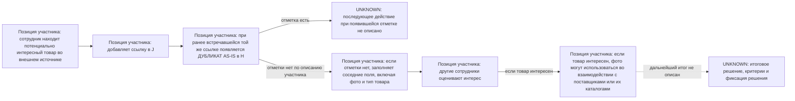

# AS-IS: текущее рассмотрение товарных предложений

> [Индекс анализа](README.md) · [Текущий контекст](current-context.md) · [ART-00](00-source-and-decision-register.md) · [ART-01](01-vision-and-scope.md) · [ART-02](02-stakeholders-and-glossary.md) · [План-контракт v0.2](reviews/03-as-is-v0.2-plan-contract.md)

| Поле | Значение |
|---|---|
| ID | `ART-03` |
| Версия | v0.3 |
| Дата | 2026-08-26 |
| Статус | `APPROVED_BY_OWNER`; independent review `PASS`, 0/0/0 |
| Владелец и утверждающий | Пользователь проекта |
| Автор | Codex |
| Нормативные входы | [ART-00](00-source-and-decision-register.md) v1.4, `APPROVED_BY_OWNER`; `SRC-034`; [ART-01](01-vision-and-scope.md) v0.8, `APPROVED_BY_OWNER`; [ART-02](02-stakeholders-and-glossary.md) v0.5, `APPROVED_BY_OWNER` |
| Следующий quality gate | Следующий зависимый артефакт: `ART-05` бизнес-правила |

## 1. Назначение и доказательная граница

Этот артефакт фиксирует доступную реконструкцию текущего рассмотрения товарного предложения. Его задача — отделить наблюдения и слова участника от неизвестных свойств процесса до проектирования TO-BE.

Доказательная база ограничена расшифровкой одного интервью (`SRC-001`) и локальным CSV-снимком рабочей таблицы (`SRC-003`). Первичный production-источник таблицы недоступен по сообщению владельца (`SRC-015`), а CSV не хранит форматирование, валидации, комментарии, изображения поверх сетки и формульную логику. Поэтому документ не устанавливает полноту процесса, права доступа, семантику всех полей или алгоритм отметки в столбцах H–J.

`ДУБЛИКАТ AS-IS` ниже означает только текущую отметку повторного внешнего идентификатора в столбце H по `DEC-032`. Это не `SAME_PRODUCT`, `VARIANT`, `UNRELATED` или `UNCERTAIN`: такие значения относятся к целевому продукту и не выводятся из текущей таблицы.

## 2. Источники, метод и ограничения

| Основание | Что использовано | Метод | Ограничение |
|---|---|---|---|
| `SRC-001` | Явно описанные участником действия прямого и обратного сценариев | Каждое положение изложено как позиция участника, а не как наблюдение production-процесса | Нет даты разговора, разметки говорящих и вопросов; заметны признаки автоматической расшифровки |
| `SRC-003` | Структура CSV и обезличенные агрегаты логических записей 1–1541, включая данные 6–1541 | Локальное чтение CSV без перехода по ссылкам и без восстановления ошибок экспорта | Снимок не подтверждает актуальность исходной таблицы, формулы, форматирование, комментарии, изображения или зависимые вкладки |
| `SRC-015` и ограничение `CON-001` из `ART-01` | Сообщение о недоступности исходной таблицы | Ограничение учтено при определении предела доказательств | Нельзя подтвердить полноту процесса и объяснить механизм отметок по доступным материалам |

Утверждённые решения владельца используются только для терминов и границ, но не являются самостоятельным доказательством наблюдаемого AS-IS-поведения. Если доступный источник не отвечает на вопрос, это обозначено как `UNKNOWN`; такие пробелы маршрутизированы через значимые `GAP-*` из `ART-00`.

## 3. Участники текущего контекста

| Участник или группа | Подтверждённое участие | Основание | Что остаётся неизвестным |
|---|---|---|---|
| Сотрудник, находящий товар | По описанию участника, ищет интересные товары во внешних интернет-магазинах или на маркетплейсе и заносит находку в таблицу | `SRC-001`, фрагмент о поиске и вставке ссылки | Полный перечень должностей, лиц и прав; пример «маркетолог» не доказывает формальную роль |
| Другие сотрудники | После заполнения соседних полей могут оценить, насколько товар интересен | `SRC-001`, фрагмент «другие сотрудники тоже посмотрят» | Конкретные люди, критерии, порядок и полномочия |
| Сотрудник, проверяющий историю по фотографии | Берёт фотографию поставщика и визуально сравнивает её с каталогом фотографий в таблице | `SRC-034`, уточнение владельца | Полный перечень сотрудников, частота проверок и критерии сравнения |
| Лицо, принимающее итоговое решение | `UNKNOWN`: доступные источники не описывают его участие в AS-IS | `SRC-001`; `GAP-002` | Нельзя переносить TO-BE-полномочия руководителя ассортимента в AS-IS без отдельного свидетельства |

Функциональные роли из `ART-02` задают границу целевого продукта, но не являются организационной моделью AS-IS.

## 4. Прямой сценарий: находка во внешнем источнике

Диаграмма показывает степень доказанности узлов, а не формулу, автоматизацию или целевой процесс.

| Подтверждённое положение | Основание | Ограничение |
|---|---|---|
| Сотрудник может искать товары во внешних источниках и занести ссылку на находку в столбец J | `SRC-001`, фрагмент о поиске товара и вставке ссылки в J | Конкретные критерии поиска, все источники и обязательность шага не зафиксированы |
| Если ранее вносилась та же ссылка, текущая таблица показывает `ДУБЛИКАТ AS-IS` в H | `SRC-001`, фрагмент о повторе той же ссылки и отметке H; термин уточнён `DEC-032` | Это не доказывает формулу, правила нормализации ссылки или связь H–I–J |
| Если отметка не появилась, сотрудник заполняет соседние поля; среди названных значений — сохранённая фотография товара и его тип | `SRC-001`, фрагмент о заполнении соседних колонок, фото и типе товара | Набор обязательных полей, валидации и последовательность заполнения неизвестны |
| Другие сотрудники могут оценить интерес товара; если товар интересен, фотографии могут использоваться во взаимодействии с поставщиками или их каталогами | `SRC-001`, фрагмент о просмотре другими сотрудниками и показе фото поставщикам | Не подтверждены критерии интереса, итоговые статусы, каналы и правила взаимодействия |
| `UNKNOWN`: действие после появления `ДУБЛИКАТ AS-IS` не установлено | `SRC-001` описывает отметку, но не последующее действие; `GAP-004` | Нельзя выводить блокировку, продолжение заполнения, решение или иной шаг |
| `UNKNOWN`: завершение ветки без отметки, ЛПР и место фиксации результата не установлены | `SRC-001`; `GAP-002`, `GAP-004` | Нельзя приписать таблице или её полю статус бизнес-решения |

### Предел текущей отметки

| Позиция участника | Основание | Ограничение |
|---|---|---|
| Та же товарная позиция с другой ссылкой, на другом сайте или после «перезаведения» не получает текущую отметку только по описанному признаку | `SRC-001`, фрагмент о другой ссылке и отсутствии совпадения | Это не подтверждает алгоритм сравнения и не классифицирует товар как `SAME_PRODUCT` |
| При копировании ссылки с дополнительными параметрами текущая отметка также может не появиться | `SRC-001`, фрагмент о «хвостах и метках» ссылки | Не установлены виды ссылок и преобразований, которые охватывает или не охватывает таблица |
| Связь новой находки с ранее рассмотренным тем же товаром при разных внешних идентификаторах не отмечается; сотрудники пытаются вспомнить предыдущие проверки | `SRC-001`, фрагменты о невозможности отметить связь и о памяти сотрудников | Не измерены частота, потери времени и доля пропусков; в `ART-00` зафиксировано отсутствие измеренного baseline |

## 5. Обратный сценарий: визуальная проверка по фотографии поставщика

| Позиция участника или неизвестное | Основание | Ограничение |
|---|---|---|
| Сотрудник берёт фотографию поставщика и визуально сравнивает её с каталогом фотографий в таблице | `SRC-034`, уточнение владельца | Не установлены критерии визуального сравнения и полнота каталога |
| Если сотрудник находит ту же позицию или аналог, товар считается найденным | `SRC-034`, уточнение владельца | Это AS-IS-оценка сотрудника, а не целевая классификация `SAME_PRODUCT` / `VARIANT` |
| Отметка о найденном товаре может не появиться: сотрудник может забыть её поставить | `SRC-034`, уточнение владельца | Неизвестны место отметки, её обязательность и контроль заполнения |
| Если товар не найден в каталоге, сотрудник мог пропустить его по ошибке | `SRC-034`, уточнение владельца | Неизвестны частота ошибок и способ их выявления |

## 6. Наблюдаемая структура доступного снимка таблицы

Ниже приведены только результаты воспроизводимого чтения `SRC-003`; значения товаров, ссылок, людей и коммерческих показателей не публикуются. Логические записи CSV 1–1541 включают заголовки и технические строки; диапазон данных — 6–1541, всего 1 536 записей. Все количественные результаты относятся к снимку, а не к актуальной рабочей таблице.

| Наблюдение | Основание | Ограничение |
|---|---|---|
| CSV-снимок содержит 22 экспортированных столбца A:V и 1 536 непустых записей данных | `SRC-003`, логические записи 1–1541; локальный подсчёт без раскрытия содержимого | CSV не подтверждает исходное форматирование, объединённые ячейки и наличие иных вкладок |
| В H снимка 60 записей содержат `ДУБЛИКАТ`; в логических записях 6 и 10 одновременно наблюдаются одинаковые экспортированные значения I и такая отметка H | `SRC-003`, столбцы H–I, логические записи 6 и 10; сводный подсчёт H | Не установлены формула, нормализация, полный ключ сравнения и смысл связи H–I–J |
| В снимке 1 524 записи имеют непустое значение J, 321 — непустое значение K; 452 записей имеют в M экспортированное значение `#REF!` | `SRC-003`, столбцы J, K и M; локальный подсчёт без перехода по ссылкам | Непустое поле не доказывает доступность ссылки или изображения; `#REF!` не означает отсутствие фото без проверки источника |
| `UNKNOWN`: семантика полей статуса, отбора и приоритета не установлена только по заголовкам и экспортированным значениям | `SRC-003`, строка заголовков и диапазон A:V; `GAP-004` | CSV не передаёт инструкции, выпадающие списки, формулы и контекст использования полей |

## 7. Значимые открытые вопросы и ограничения

| Пробел | Влияние на AS-IS | Маршрут |
|---|---|---|
| `GAP-002`: авторизация и совмещение ролей | Должности уточнены для TO-BE, но AS-IS-права доступа не инвентаризированы | Бизнес-правила и NFR |
| `GAP-003`: пограничные критерии идентичности и варианта | Нельзя интерпретировать пример товара другого цвета как бизнес-правило | Глоссарий и будущие бизнес-правила |
| `GAP-004`: семантика статусов, решений и исключений таблицы | Нельзя надёжно описать точки контроля, критерии или механизм текущей отметки | Walkthrough с пользователем и разрешённое read-only исследование копии |
| `GAP-005`: доступность и пригодность изображений | Нельзя считать непустые поля готовым корпусом изображений или историей | Инвентаризация для требований к данным |
| `GAP-007`: владелец и классификация данных | Ограничивает дальнейшую проверку и публикацию примеров | Решение владельца данных; до него действует `RESTRICTED_PENDING_CLASSIFICATION` |
| Полнота корпуса и доступные архивы | Нельзя считать снимок полной историей рассмотрений | Инвентаризация источников для требований к данным; доступность пока только заявлена или неизвестна |

Отдельно, время процесса, повторная работа и пропущенная история не измерялись; это ограничивает любые количественные выводы об AS-IS.

## 8. Компактная трассировка

| Раздел | Основание | Что из него не следует |
|---|---|---|
| Участники, прямой и обратный сценарии, предел текущей отметки | `SRC-001` | Официальные роли, полномочия, алгоритм сравнения, обязательность шагов, формула или хранение причины решения |
| Структура снимка и количественные агрегаты | `SRC-003` | Актуальность production-таблицы, доступность URL, формульная логика, изображения или смысл связи H–I–J |
| Неизвестные роли, семантика, изображения и классификация данных | `GAP-002`–`GAP-005`, `GAP-007`; ограничения `SRC-001`/`SRC-003` | Новый факт, требование, TO-BE-решение или технический способ проверки |
| Термин `ДУБЛИКАТ AS-IS` | `DEC-032`; контекст `SRC-001`/`SRC-003` | Равенство текущей отметки целевому `SAME_PRODUCT` |

## 9. Авторская самопроверка и quality gate

| Проверка | Результат v0.2 | Ограничение или следующий шаг |
|---|---|---|
| Локальные `ASIS-*` выведены из употребления; из ID сохранены только источники, решения и значимые междокументные `GAP-*` | `PASSED` | На удалённые локальные ID нет нормативных ссылок из утверждённых артефактов; изменение зафиксировано в истории версии |
| Подтверждённые позиции и неизвестные из v0.1 сохранены без нового предметного вывода | `PASSED` | Достаточность и отсутствие регрессий проверяет независимый ревьюер |
| Прямой и обратный сценарии разделены; ветки `ДУБЛИКАТ AS-IS` и отсутствия отметки не смешаны | `PASSED` | Полнота ограничена `SRC-001`; последующие действия и итог остаются `UNKNOWN` |
| `ДУБЛИКАТ AS-IS` не смешан с `SAME_PRODUCT`; TO-BE, UI, архитектура, разработка и требования не добавлены | `PASSED` | Такие решения принадлежат следующим артефактам |
| Локальные ссылки, Markdown-таблицы, Mermaid и действующие `SRC-*`/`DEC-*`/`GAP-*` проверены | `PASSED` | Нужна независимая read-only проверка перед передачей владельцу |
| Ограниченные данные, полный идентификатор Google Sheets, сырые URL, товарные, персональные и коммерческие значения не опубликованы | `PASSED` | До решения владельца данных действует `RESTRICTED_PENDING_CLASSIFICATION` |

Независимая read-only проверка v0.2 завершилась `PASS` (`0 Critical / 0 Major / 0 Minor`); отчёт — [review v0.2](reviews/03-as-is-v0.2-review.md). Замечаний для обработки нет. 2026-08-18 владелец явно утвердил v0.2 (`SRC-028`); статус переведён в `APPROVED_BY_OWNER`.

Независимое review поправки v0.3 — `PASS` (`0 Critical / 0 Major / 0 Minor`): [отчёт](reviews/role-and-lifecycle-amendment-v0.1-review.md). Редакция утверждена владельцем (`SRC-035`).

## 10. История версии

| Версия | Статус | Изменение |
|---|---|---|
| v0.1 | `REWORK_BY_POLICY` | Предыдущие предметные findings закрыты повторным review `0 Critical / 0 Major / 0 Minor`; owner gate был открыт заново только для применения `DEC-036`. |
| v0.2 | `APPROVED_BY_OWNER` | По `DEC-036` локальные `ASIS-*` выведены из употребления без таблицы соответствия: нормативных ссылок на них в утверждённых артефактах нет. Сохранены факты, ограничения, источники и только значимые междокументные `GAP-*`; независимое review завершилось `PASS` (`0/0/0`), затем владелец утвердил редакцию (`SRC-028`). |
| v0.3 | `APPROVED_BY_OWNER` | По `SRC-034` исправлен обратный сценарий: поставщик не участник процесса, сотрудник вручную сравнивает фотографию поставщика с каталогом фотографий; учтены пропуск отметки и возможный пропуск товара. Независимое review — `PASS`, 0/0/0; утверждено владельцем (`SRC-035`). |
