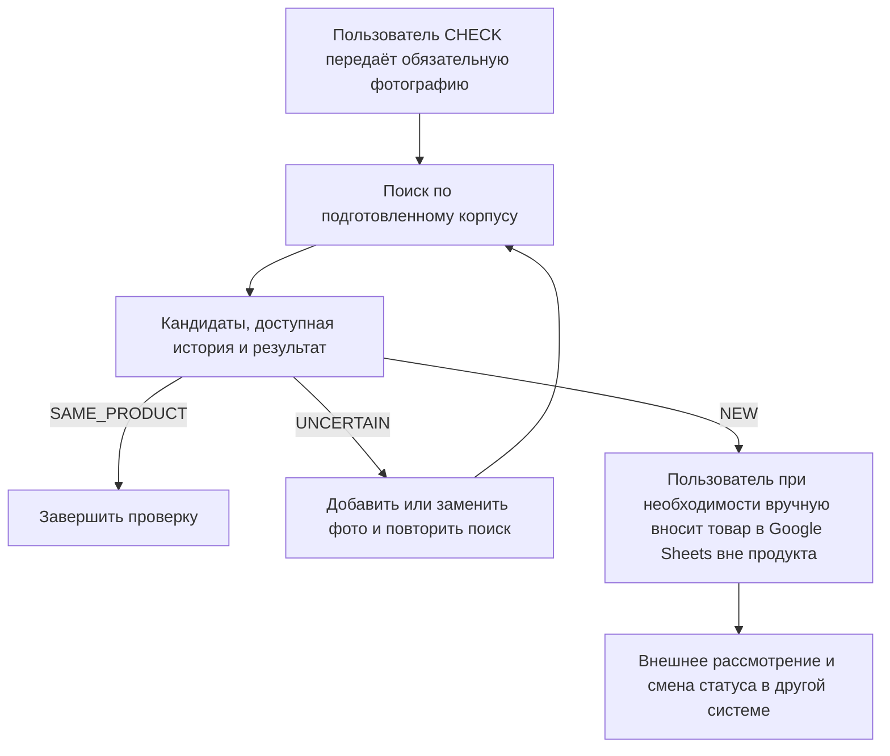

# TO-BE: целевой процесс рассмотрения товарного предложения

> [Индекс анализа](README.md) · [Текущий контекст](current-context.md) · [ART-00](00-source-and-decision-register.md) · [ART-01](01-vision-and-scope.md) · [ART-02](02-stakeholders-and-glossary.md) · [ART-03](03-as-is.md) · [План текущей поправки](reviews/mvp-check-only-and-sheets-boundary-v0.1-plan-contract.md)

| Поле | Значение |
|---|---|
| ID | `ART-04` |
| Версия | v0.7 |
| Дата | 2026-08-28 |
| Статус | `APPROVED_BY_OWNER`; `SRC-043`; итоговое independent review: `PASS`, 0 Critical / 0 Major / 0 Minor |
| Владелец и утверждающий | Пользователь проекта |
| Автор | Codex |
| Нормативные входы | [ART-00](00-source-and-decision-register.md) v1.9 `DRAFT`; `DEC-044`–`DEC-053`; [ART-01](01-vision-and-scope.md) v1.1 `DRAFT`; [ART-02](02-stakeholders-and-glossary.md) v0.7 `DRAFT`; [ART-03](03-as-is.md) v0.3 `APPROVED_BY_OWNER` |
| Следующий quality gate | Закрыт `SRC-043`; следующий зависимый этап определяется отдельным планом |

## 1. Назначение и граница

Этот артефакт описывает целевой бизнес-процесс внутреннего инструмента поддержки решения: как товарное предложение поступает на поиск, как пользователям возвращаются кандидаты и история и где остаётся человеческое бизнес-решение. Он не описывает техническую реализацию и не восстанавливает AS-IS.

Целевой продукт принимает фотографию и доступные сведения о товаре, ищет по согласованному корпусу ранее рассмотренные позиции и возвращает кандидатов с историей. Итог поиска — `NEW`, `SAME_PRODUCT` или `UNCERTAIN`; отношение к конкретному отличающемуся кандидату — `VARIANT` или `UNRELATED`, а для `SAME_PRODUCT` — `N/A`. Это результаты поиска, не разрешение и не запрет ввода товара (`DEC-001`, `DEC-028`–`DEC-031`).

Финансовая оценка, самостоятельный поиск по каталогам поставщиков, закупка, коммуникация с поставщиками, архитектура, модель, БД, API и UI находятся вне границы этого документа (`ART-01`, §6.2). Фотография поставщика может быть входными данными, но поставщик не участвует в процессе (`DEC-044`).

## 2. Роли и ответственность

| Роль | Целевое участие | Граница ответственности | Основание |
|---|---|---|---|
| `USR-003` — Пользователь `CHECK` | Передаёт фотографию, сверяет товар с корпусом и читает доступные кандидаты, статусы и историю | Не создаёт и не изменяет записи | `DEC-053` |
| `USR-001` — Менеджер ассортимента | Работает с товаром в Google Sheets вне продукта | Не имеет продуктовой роли MVP | `DEC-053` |
| `USR-002` — Руководитель ассортимента | Рассматривает товар и меняет его статус в другой системе | Не имеет продуктовой роли MVP | `DEC-053` |
| Целевой продукт | Принимает фотографию, ищет по подготовленному корпусу и показывает кандидатов, доступную историю и результаты поиска | Не создаёт карточки, не пишет в Google Sheets, не меняет статус, категорию или роли | `DEC-001`, `DEC-003`, `DEC-053` |

## 3. Минимальный целевой поток

Диаграмма задаёт бизнес-последовательность и границу ответственности, а не экранный сценарий, API-вызовы, модель данных или автоматизацию.

| Шаг | Целевое действие | Граница | Основание |
|---|---|---|---|
| Вход и поиск | Пользователь `CHECK` передаёт фотографию; продукт ищет по подготовленной копии корпуса | Поиск начинается, если распознано хотя бы одно изображение. Форматы и размеры не определены | `DEC-050`, `DEC-053` |
| Выдача | Продукт показывает кандидатов, доступные статусы и историю, итог `NEW` / `SAME_PRODUCT` / `UNCERTAIN` и применимое отношение к кандидату | Состав и качество корпуса не инвентаризированы полностью | `DEC-003`, `DEC-053`, `GAP-001`, `GAP-005` |
| `NEW` | Пользователь при необходимости вручную вносит товар в Google Sheets для рассмотрения | Это внешний шаг; продукт не создаёт запись и не пишет в таблицу | `DEC-053` |
| Повтор `UNCERTAIN` | Пользователь добавляет или заменяет фотографию и повторяет поиск | Неразрешённый результат не сохраняется и не подменяется другим классом | `DEC-050`, `DEC-053` |
| Внешнее рассмотрение | Руководитель меняет статус в другой системе | В MVP нет интерфейса, роли или функции руководителя | `DEC-053` |

## 4. Использование результатов поиска

| Результат поиска | Что обязан предоставить процесс | Что из результата не следует |
|---|---|---|
| `SAME_PRODUCT` и `N/A` | Доступный подтверждённый тот же товар-кандидат и его история | Автоматическое разрешение, запрет или перенос прежнего бизнес-решения |
| `NEW` | Что в доступном корпусе тот же товар не найден, а также доступные релевантные кандидаты и история, если они есть | Создание записи или присвоение жизненного статуса. Пользователь может вручную вне продукта внести товар в Google Sheets |
| `UNCERTAIN` | Что доступных данных недостаточно для подтверждения или исключения того же товара; возможность добавить фото/метаданные и повторить поиск | Принудительное отнесение к `NEW` или `SAME_PRODUCT`; сохранение неразрешённого результата |
| `VARIANT` | Что конкретный отличающийся кандидат является вариантом той же базовой модели | Перенос бизнес-решения между вариантами |
| `UNRELATED` | Что конкретный кандидат является другим товаром | Отсутствие других релевантных кандидатов в полном корпусе |

`ANALOG` не возвращается как отдельный класс: похожая, но иная модель является другим товаром (`DEC-030`).

## 5. Внешнее рассмотрение и статусы

Статусы — свойства записей внешнего корпуса, а не результаты поиска. Продукт показывает доступные статусы и историю, но не создаёт записи и не меняет статусы.

После ручного внесения в Google Sheets руководитель рассматривает товар в другой системе. Логика переходов, причина отклонения и управление категориями не входят в MVP; при наличии причины в доступных данных применяется правило показа `ART-06`.

## 6. Точки контроля и незакрытые решения

| Точка | Уже определено | Что требует решения владельца | Маршрут |
|---|---|---|---|
| Достаточность входа | Фотография обязательна; текстовые метаданные опциональны. Поиск начинается после технического распознавания хотя бы одного изображения; недостаток содержания приводит к `UNCERTAIN` | Форматы, размеры и полный состав метаданных | `DEC-050`; требования к данным |
| Результат `UNCERTAIN` | Система предлагает другое или дополнительное фото и повторный поиск; неразрешённый результат не сохраняется | В MVP нет системного лимита повторов; правила следующего расширения определяются при необходимости | `DEC-050`; `ART-06` |
| Внешнее рассмотрение | Руководитель меняет статус в другой системе; MVP только читает доступные сведения | Формат ID, справочник причин, правила переходов и хранения | `DEC-052`, `DEC-053`, `GAP-006` |
| Исключения и конфликт истории | Продукт показывает все доступные конфликтующие записи и обозначает конфликт | Детальные правила хранения, причины конфликтов и способ разрешения | `DEC-050`, `DEC-053`, `GAP-006`, `GAP-004` |

Документ не определяет требования к интерфейсу, модель данных или способ хранения.

## 7. Граница TO-BE и следующие артефакты

| Входит в TO-BE | Не определяется в TO-BE | Следующий маршрут |
|---|---|---|
| Роли, последовательность бизнес-действий, точки человеческого решения, использование результатов поиска и исключения как решения владельца | Детальные бизнес-правила по категориям, пользовательские сценарии, обязательные поля, модель данных, NFR, метрики, архитектура и реализация | `ART-05`–`ART-09` после закрытия соответствующих решений и gate `ART-04` |

Пограничные правила `SAME_PRODUCT` и `VARIANT` по категориям остаются `UNKNOWN` (`GAP-003`) и не заменяются этим процессом. Владение и классификация данных остаются `UNKNOWN` (`GAP-007`), поэтому ограниченные примеры и исходники не публикуются.

## 8. Компактная трассировка

| Раздел | Основание | Что из него не следует |
|---|---|---|
| Роль `CHECK`, внешний процесс и статусы | `DEC-001`, `DEC-053` | Авторизацию, запись в Google Sheets, управление статусом, модель данных или автоматическое решение |
| Корпус, выдача кандидатов и история | `DEC-003`, `ART-01`, §6.1 | Доступность, полнота, модель данных, интеграция или регулярное обновление |
| Две оси результата и исключение `ANALOG` | `DEC-028`–`DEC-031` | Правила по категориям или перенос бизнес-решения между кандидатами |
| Вход, `UNCERTAIN` и исключения | `DEC-050`, `DEC-053`; границы `GAP-003`–`GAP-005`, `GAP-007` | Форматы изображений, схема записи или технический способ реализации |

## 9. Авторская самопроверка и quality gate

| Проверка | Результат авторской самопроверки v0.7 | Ограничение или следующий шаг |
|---|---|---|
| План-контракт выполнен: документ описывает TO-BE, а не AS-IS или техническое решение | `PASSED` | Семантическую достаточность и границы проверяет независимый ревьюер |
| Роль `CHECK`, обязательная фотография и маршрут `UNCERTAIN` согласованы с `DEC-050`, `DEC-053` | `PASSED` | Форматы изображений и авторизация остаются неизвестными |
| `NEW` не создаёт запись; ручное внесение и рассмотрение находятся вне продукта | `PASSED` | Детальная модель внешней записи не разрабатывается для MVP |
| Автоматические переходы, обмен с Google Sheets и автоматическое разрешение конфликта отсутствуют; `GAP-006` сохранён | `PASSED` | Данные обмена требуют отдельной разработки MVP 1.1 |
| Проверены локальные ссылки, Markdown-таблицы, Mermaid, действующие `DEC-*`/`GAP-*` и отсутствие новых небазовых ID | `PASSED` | Независимое review текущего пакета требует исправлений и повторной проверки |

Независимая read-only проверка v0.1 завершилась `PASS` (`0 Critical / 0 Major / 0 Minor`); отчёт — [review v0.1](reviews/04-to-be-v0.1-review.md). Решения `DEC-038`–`DEC-040` получены после этой проверки, поэтому v0.2 требует нового независимого review и явного owner gate.

Независимая read-only проверка v0.2 завершилась `PASS` (`0 Critical / 0 Major / 0 Minor`); отчёт — [review v0.2](reviews/04-to-be-v0.2-review.md). Критик подтвердил разделение двух сценариев в Mermaid, сохранение `GAP-006`, отсутствие технических решений и новых локальных ID. Редакция ожидает явного утверждения владельца.

Независимое review поправки v0.3 — `PASS` (`0 Critical / 0 Major / 0 Minor`): [отчёт](reviews/role-and-lifecycle-amendment-v0.1-review.md). Редакция утверждена владельцем (`SRC-035`).

Для v0.5 авторская самопроверка завершена. Первичное независимое review общего пакета `ART-00` v1.7 / `ART-04` v0.5 / `ART-06` v0.2 выявило 2 `Major` и 3 `Minor`; после исправлений повторное review завершилось `PASS`, 0/0/0. Исторические отчёты выше относятся к предыдущим версиям и не закрывают текущий gate.

## 10. История версии

| Версия | Статус | Изменение |
|---|---|---|
| v0.1 | `DRAFT` | Первый TO-BE-документ: зафиксирован минимальный целевой поток по утверждённым решениям; точки контроля, обработка `UNCERTAIN`, исключения и фиксация бизнес-решения оставлены как `GAP-006` / `DECISION_REQUIRED`. Независимое review — `PASS` (`0/0/0`); требуются решения владельца перед содержательным закрытием TO-BE. |
| v0.2 | `PENDING_OWNER_APPROVAL` | Применены `DEC-038`–`DEC-040`: два сценария, обязательная фотография, повторный `UNCERTAIN` без сохранения, условия сохранения и роль ЛПР. `GAP-006` сохранён для источника истины, схемы и детальных исключений; независимое review — `PASS` (`0/0/0`), ожидается owner gate. |
| v0.3 | `APPROVED_BY_OWNER` | Внесены решения `DEC-042`–`DEC-043`: официальные должности, отдельная роль сотрудника, `SUBMIT_FOR_REVIEW` как действие, `ADD_FOR_REVIEW` как начальный статус и ручной жизненный цикл записи. Текст отредактирован по `humanizer-ru` в техническом жанре; независимое review — `PASS`, 0/0/0; утверждено владельцем (`SRC-035`). |
| v0.4 | `APPROVED_BY_OWNER` | Внесены `DEC-044`–`DEC-046`, затем исправлены границы и self-check по `DEC-047`–`DEC-048`. Повторное independent review пакета — `PASS`, 0/0/0; утверждено владельцем (`SRC-039`). |
| v0.5 | `PENDING_OWNER_APPROVAL` | Применены сценарные уточнения `DEC-050`: технический допуск изображения, неограниченные повторы `UNCERTAIN` и показ конфликтующих записей без автоматического выбора. После исправления первичных замечаний повторное review — `PASS`, 0/0/0; ожидается owner gate. |
| v0.6 | `PENDING_OWNER_APPROVAL` | По `SRC-041`, `DEC-052` причина отказа стала необязательной, а жизненные статусы закреплены как решения по карточке без фактического ввода товара в ассортимент. Повторное independent review — `PASS`, 0/0/0; ожидается owner gate. |
| v0.7 | `APPROVED_BY_OWNER` | По `SRC-042`, `DEC-053` MVP ограничен ролью `CHECK`; ручное внесение и рассмотрение перенесены во внешний процесс, а обмен с Google Sheets — в MVP 1.1. Итоговое independent review — `PASS`, 0/0/0; утверждено владельцем (`SRC-043`). |
