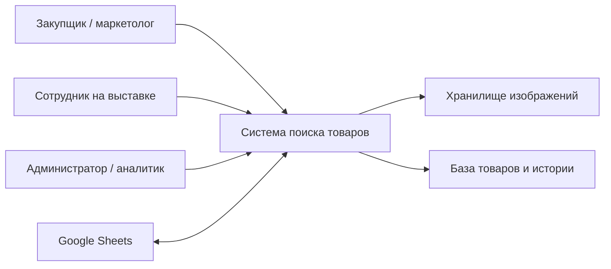
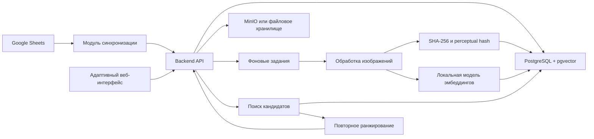
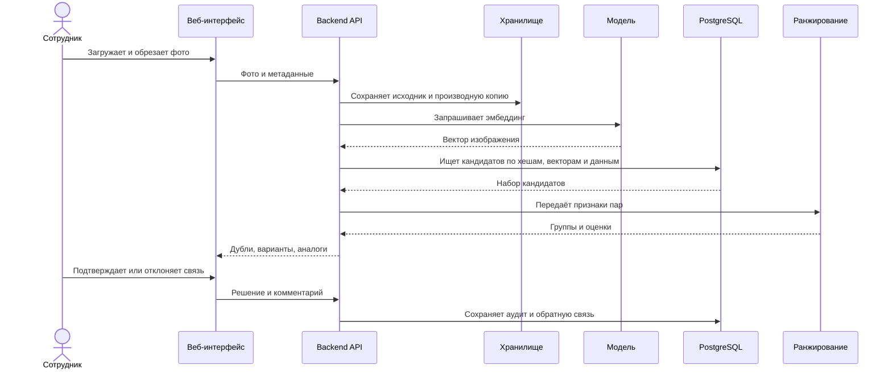
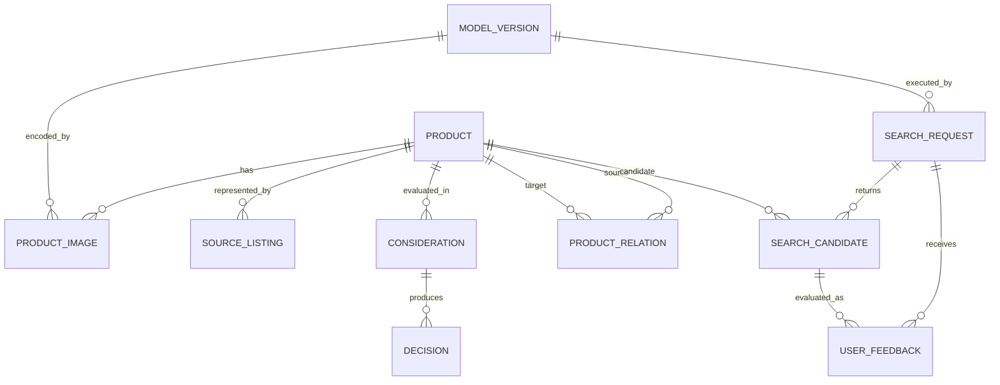
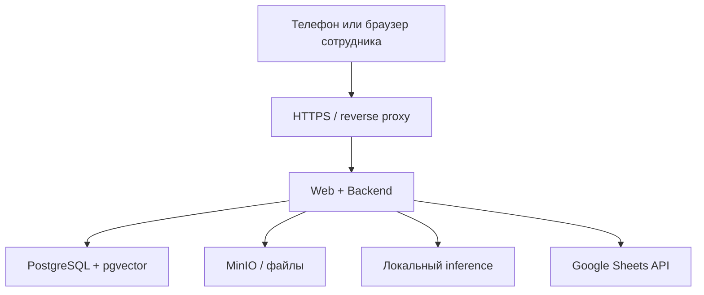

# Архитектура MVP

> **Историческая техническая гипотеза.** Документ создан до утверждения аналитического пакета и содержит заменённые продуктовые положения. Не использовать как требование или принятое решение. Начать с [текущего контекста](analysis/current-context.md) и [индекса анализа](analysis/README.md).

**Проект:** поиск дублей и аналогов товаров
**Статус:** `HISTORICAL_DRAFT`; ненормативная техническая гипотеза
**Дата фиксации:** 2026-08-12

## 1. Назначение

Система принимает изображение товара и доступные метаданные, ищет ранее рассмотренные позиции и показывает пользователю кандидатов вместе с историей их проработки.

Система является инструментом поддержки решения. Она не должна автоматически запрещать ввод товара или заменять ответственное решение сотрудника.

## 2. Архитектурные драйверы

- около 15 000 товаров на старте;
- прирост около 500 товаров в месяц;
- несколько изображений на один товар;
- каталожные и полевые фотографии;
- поиск должен работать с компьютера и телефона;
- данные и модели предпочтительно размещаются локально;
- Google Sheets остаётся частью текущего процесса;
- требуется история проработки и пользовательских подтверждений;
- модель должна заменяться без миграции основной предметной модели;
- качество важнее полностью автоматического решения.

## 3. Ключевые принципы

1. Каноническая сущность товара не равна строке Google Sheets или карточке поставщика.
2. Изображение, текст и структурированные характеристики обрабатываются независимо.
3. Кандидаты собираются несколькими способами, а затем повторно ранжируются.
4. «Дубль», «вариант» и «аналог» являются разными типами отношений.
5. Значение векторной близости не является готовой вероятностью.
6. Пользовательская обратная связь сохраняется вместе с версией модели.
7. Исходные изображения не хранятся внутри таблицы как единственный экземпляр.
8. MVP строится как модульное приложение, а не как набор микросервисов.

## 4. Контекст

## 5. Контейнерная архитектура

На этапе прототипа фоновые задания могут выполняться внутри backend-процесса. Отдельная очередь добавляется только при подтверждённой необходимости.

## 6. Компоненты

### 6.1. Веб-интерфейс

Функции:

- загрузка изображения из файла или камеры;
- ручная обрезка интересующего объекта;
- ввод или выбор метаданных;
- показ кандидатов по группам;
- просмотр истории товара;
- подтверждение типа связи;
- отображение ошибок и состояния обработки.

Предварительный вариант — адаптивное веб-приложение или PWA. Нативное приложение для MVP не требуется.

### 6.2. Backend API

Ответственность:

- авторизация и проверка прав;
- управление товарами и изображениями;
- оркестрация поиска;
- сохранение пользовательской обратной связи;
- выдача истории;
- запуск импорта и синхронизации;
- аудит действий.

Предварительная технология — Python и FastAPI. Решение должно быть подтверждено ADR перед реализацией.

### 6.3. PostgreSQL

Хранит:

- канонические товары;
- карточки источников;
- попытки ввода и решения;
- метаданные изображений;
- векторные представления;
- отношения между товарами;
- поисковые запросы и кандидатов;
- подтверждения пользователей;
- версии моделей и импорта.

Для масштаба MVP рекомендуется PostgreSQL с pgvector. Сначала допустим точный поиск ближайших соседей. HNSW добавляется после измерения задержки и полноты.

### 6.4. Хранилище изображений

Исходные и производные изображения хранятся отдельно от БД. PostgreSQL содержит идентификатор, путь, контрольную сумму, формат, размеры и служебные признаки.

Варианты реализации:

- MinIO — предпочтительно при необходимости S3-совместимого API;
- локальная файловая система — допустима для начального прототипа;
- корпоративное объектное хранилище — для дальнейшего внедрения.

### 6.5. Обработка изображений

Операции:

- проверка формата и размера;
- нормализация ориентации;
- создание безопасной производной копии;
- ручная обрезка;
- вычисление SHA-256;
- вычисление perceptual hash;
- генерация одного или нескольких эмбеддингов.

Автоматическое обнаружение нескольких объектов не является обязательной частью MVP.

### 6.6. Поиск кандидатов

Кандидаты формируются независимыми контурами:

1. Точная копия файла по SHA-256.
2. Изменённая копия изображения по perceptual hash.
3. Тот же или визуально близкий товар по эмбеддингам.
4. Текстовое совпадение названия и характеристик.
5. Совпадение структурированных атрибутов.

Результаты контуров объединяются с сохранением исходных оценок.

### 6.7. Повторное ранжирование

Для пары «запрос — кандидат» используются признаки:

- точное совпадение файла;
- расстояние perceptual hash;
- визуальная близость;
- категория;
- бренд;
- название;
- материал, размер, цвет и комплектация;
- распознанная маркировка, если OCR применим;
- ранее подтверждённые связи.

На первом этапе применяются прозрачные правила или простая обучаемая модель. Более сложное дообучение допускается после накопления достаточной разметки.

### 6.8. Google Sheets

Google Sheets является интерфейсом текущего процесса, но не источником истины для изображений, истории поиска и связей.

Предлагаемые служебные поля:

- `product_id`;
- `sync_status`;
- `last_synced_at`;
- `search_status`;
- `result_url`;
- `error_message`.

Синхронизация должна быть идемпотентной. Для первой загрузки рекомендуется контролируемый CSV-экспорт, а постоянную интеграцию следует реализовывать после стабилизации доменной модели.

## 7. Поток онлайн-поиска

## 8. Предварительная доменная модель

### Основные сущности

| Сущность | Назначение |
|---|---|
| Product | Каноническая позиция во внутренней истории |
| ProductImage | Исходное или производное изображение товара |
| SourceListing | Карточка у поставщика, конкурента или в каталоге |
| Consideration | Конкретная попытка проработки товара |
| Decision | Ввод, отказ, вывод или другое бизнес-решение |
| ProductRelation | Подтверждённая связь двух товаров |
| SearchRequest | Факт выполнения поиска и его входные данные |
| SearchCandidate | Кандидат с оценками отдельных механизмов |
| UserFeedback | Решение пользователя по кандидату |
| ModelVersion | Версия модели и параметров обработки |

Термин `Product` требует отдельного подтверждения: в некоторых бизнес-процессах канонической сущностью может оказаться модель товара, а цветовые и размерные варианты — отдельными SKU.

## 9. Классы результата

| Класс | Интерпретация |
|---|---|
| SAME_PRODUCT | Та же модель, независимо от продавца, ссылки или ракурса |
| VARIANT | Та же товарная семья с отличием по варианту |
| ANALOG | Похожий форм-фактор или назначение, но другая модель |
| UNRELATED | Недостаточно оснований считать товары связанными |
| UNCERTAIN | Система или пользователь не могут принять уверенное решение |

Пороговые значения задаются по результатам контрольной выборки и могут различаться между категориями.

## 10. Источники истины

| Данные | Источник истины для MVP |
|---|---|
| Рабочие метаданные до миграции | Google Sheets |
| Канонический идентификатор | PostgreSQL |
| Исходные изображения | Объектное/файловое хранилище |
| История проработки после импорта | PostgreSQL |
| Связи между товарами | PostgreSQL |
| Обратная связь | PostgreSQL |
| Эмбеддинги и версия модели | PostgreSQL |

Переходный период потребует явного mapping полей и правил разрешения конфликтов между Google Sheets и PostgreSQL.

## 11. Развёртывание MVP

Все компоненты могут быть развёрнуты на одном сервере через Docker Compose. Выделение inference на отдельный GPU-сервер рассматривается только при подтверждённой нагрузке.

## 12. Нефункциональные требования

### Производительность

- большинство запросов поиска — не более 5 секунд для MVP;
- формирование эмбеддинга и поиск измеряются раздельно;
- импорт новых товаров выполняется асинхронно;
- увеличение индекса не должно блокировать пользовательский поиск.

### Надёжность

- идемпотентный импорт;
- повторяемая обработка задания;
- контрольные суммы файлов;
- резервное копирование БД и изображений;
- проверяемое восстановление;
- сохранение пользовательского решения до ответа об успехе.

### Безопасность

- HTTPS;
- аутентификация;
- роли пользователя и администратора;
- ограничение размера и форматов загрузки;
- декодирование изображения безопасной библиотекой и создание производной копии;
- секреты вне репозитория;
- аудит входов, изменений и пользовательских решений;
- минимальные права сервисного аккаунта Google.

### Наблюдаемость

- структурированные логи;
- идентификатор запроса;
- метрики времени обработки;
- число ошибок импорта;
- число запросов без результатов;
- распределение пользовательских подтверждений;
- версия модели в каждом поисковом запросе.

## 13. ML-качество

Качество оценивается отдельно для:

- точных копий изображений;
- одного товара на разных изображениях;
- вариантов;
- аналогов;
- каталожных фотографий;
- полевых фотографий;
- крупных товарных категорий.

Основные метрики: Recall@1/5/10, точность блока «вероятный дубль», время ответа и доля случаев `UNCERTAIN`.

Разделение train/validation/test выполняется на уровне канонического товара или группы связанных товаров. Фотографии одного товара не должны одновременно попадать в обучающую и контрольную части.

## 14. Масштабирование

При текущем объёме отдельная векторная БД не обязательна. Возможные последующие изменения:

- добавить HNSW в pgvector при росте задержки;
- вынести фоновые задания в отдельный worker;
- добавить очередь;
- вынести inference на GPU-сервер;
- перейти на Qdrant при подтверждённой потребности в сложном фильтруемом или многовекторном поиске;
- разделить модели и пороги по категориям.

Каждое изменение принимается по измерениям и фиксируется ADR.

## 15. Открытые вопросы

1. Что является каноническим товаром: модель, SKU или попытка ввода?
2. Какие изменения образуют вариант, а какие — отдельный товар?
3. В каком виде изображения фактически вставлены в Google Sheets?
4. Где будет размещён локальный сервер и есть ли доступный GPU?
5. Какая корпоративная аутентификация доступна?
6. Какие категории войдут в пилот?
7. Какие поля характеристик структурированы, а какие представлены свободным текстом?
8. Как долго должны храниться полевые фотографии?
9. Может ли один сотрудник видеть историю всех команд и брендов?
10. Как будет разрешаться конфликт двух пользовательских разметок?

## 16. Риски

| Риск | Мера снижения |
|---|---|
| Разные трактовки дубля | Decision table, инструкция и контроль согласованности |
| Низкое качество полевых фото | Ручная обрезка, подсказки пользователю, отдельные метрики |
| Невозможность извлечь старые изображения из Sheets | Разовый контролируемый экспорт или повторная загрузка |
| Ложная уверенность оценки | Классы уверенности, `UNCERTAIN`, калибровка на разметке |
| Утечка между train и test | Разделение на уровне товарной группы |
| Сильные различия категорий | Метрики и пороги по категориям |
| Ошибки синхронизации | Идемпотентность, журнал импорта, явные статусы |
| Преждевременное усложнение | Модульный монолит, измерения до масштабирования |

## 17. Архитектурные решения, которые необходимо оформить

- ADR-0001: границы MVP и модульный монолит;
- ADR-0002: PostgreSQL + pgvector вместо отдельной векторной БД;
- ADR-0003: источник истины и роль Google Sheets;
- ADR-0004: хранение изображений;
- ADR-0005: выбор модели по benchmark;
- ADR-0006: синхронная или фоновая обработка;
- ADR-0007: способ аутентификации;
- ADR-0008: правила версионирования эмбеддингов.
